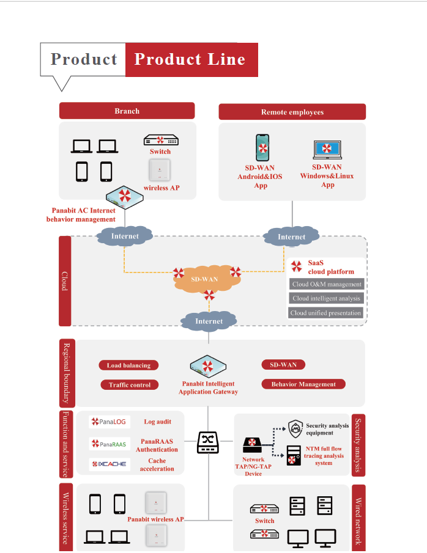

<a href="README_CN.md">中文</a> | English

# Company Introduction

## 🏢1. Who We Are? 
Founded in 2004 in Beijing, China, **Panabit** is a pioneer in network technology dedicated to making network connections safer and more efficient through intelligent solutions. Our R&D center in Wuhan supports a service network covering nationwide and oversea.

## 💡2. Core Technical Advantages 
- **Precise Identification**: Over 95% application recognition accuracy—see every bit of your network  
- **High-Speed Processing**: From gigabit to 400G throughput, meeting any scale of demand  
- **Comprehensive Tracking**: 1:1 complete log retention, keeping you fully informed of network dynamics  
- **Flexible Networking**: Innovative SDWAN technology, improving branch interconnection efficiency by 10×  

## 📊3. Core Product Matrix 
| **Product Category** | **Representative Product** | **Problem Solved**                              |
| -------------------- | -------------------------- | ----------------------------------------------- |
| Smart Gateway        | Panabit Series             | Traffic management / Security / Load balancing  |
| Network Acceleration | SDWAN                      | Instant branch connectivity                     |
| Wireless Coverage    | Panabit AP                 | Enterprise-level WiFi6 comprehensive solution   |
| Traffic Analysis     | NTM System                 | Complete traffic traceability and forensics     |
| Cloud Management     | SaaS Platform              | Remote centralized operations                   |

For more product information, please visit our official website: [www.panabit.com](http://www.panabit.com)

## 🌟4. Benchmark Service Cases 
- **Education**: Full coverage for top universities such as Tsinghua and Peking University  
- **Government**: Digital projects by the National Service Center and Digital Guangdong  
- **Operators**: Backbone network construction in 22 provinces by China Mobile  
- **Medical**: Network upgrades for top hospitals such as Xiehe Hospital  
- **Finance**: Networking for financial institutions like the Agricultural Bank headquarters  

## 🏆5. Strength Certifications 
- National specialized, refined, distinctive, and innovative enterprise  
- National standard drafting unit for threat intelligence  
- Domestic Xinchuang full-platform compatibility certification  
- CNCERT network security emergency support unit  

## 📞 6. Contact Us 
- **Website**: [www.panabit.com](http://www.panabit.com)  
- **Hotline**: 4007733996  
- **Address**: Zhongguancun Software Park, Beijing / MAX Technology Park, Wuhan  
- **Technical Support Email**: support@panabit.com

